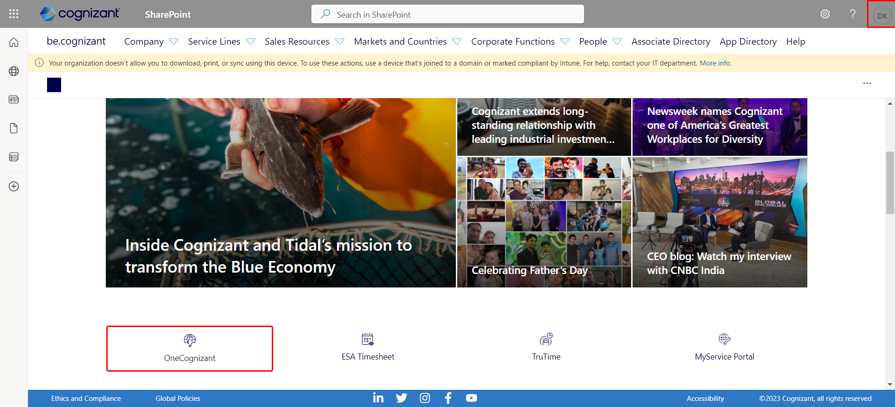
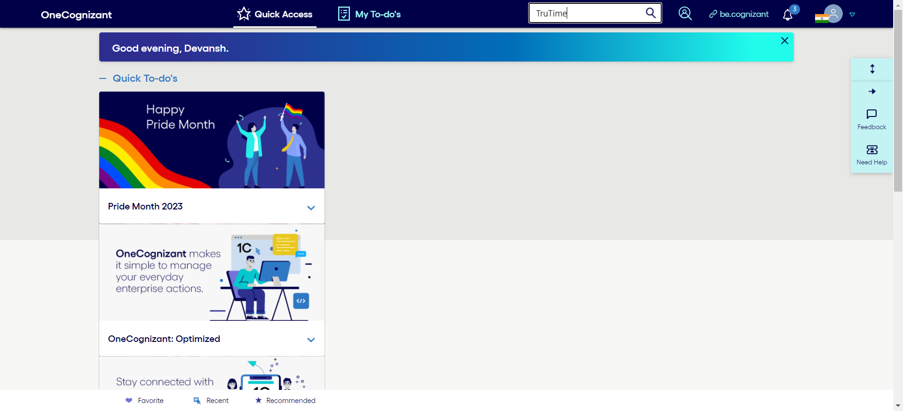
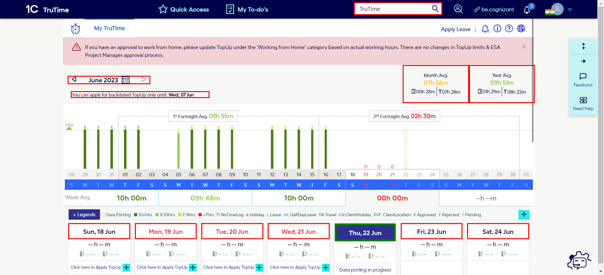

# Tru Time Validation Project

The Tru Time Validation project focuses on automating the process of validating current week details from the Tru Time application and comparing them with the system calendar. The project also aims to verify the visibility of the current date within the Tru Time application. Web scraping and automation techniques are utilized to extract and analyze the required information.

## Detailed Description
The main objective of the Tru Time Validation project is to perform the following tasks:

1. Get Current Week Details: The automation script navigates to the Tru Time application and captures the details of the current week, including the week number, start date, and end date.

2. Compare with System Calendar: The current week details obtained from Tru Time are compared with the system calendar to ensure consistency and accuracy.

3. Validate Current Date Visibility: The automation script verifies whether the current date is visible and correctly displayed within the Tru Time application.

## Key Automation Scope
The project's automation scope includes the following key aspects:

- Handling Alerts and Different Browser Windows: The automation script is designed to handle alert messages that may appear during interactions with the Tru Time application. It can also manage different browser windows, if required.

- Navigation Control: The script navigates through the Tru Time application to access the relevant sections for extracting data and performing validation tasks.

- Data Extraction and Collection: The automation script extracts the required week details from Tru Time and stores them in appropriate data structures for comparison.

- Data Driven Approach: A data-driven approach is employed, allowing the script to execute test cases with different inputs, enhancing testing coverage.

## Note
Excel_Data: The File is not present in src/resource which contained all the login  credentials. Make sure u make a Excel file keep it in that path and use it to
run the login script.

Drivers: The provided zip file does not include the necessary browser drivers (e.g., Chrome driver and Edge driver) due to size constraints. Participants need to install the required drivers separately and include them in the automation framework.

Instructions: To run the automation script successfully, follow the provided instructions to set up the necessary environment and configure the browser drivers properly.

## Disclaimer
This project is developed for learning and demonstration purposes only. The use of web scraping and automation should comply with the Tru Time application's terms of service and legal requirements. The developers are not responsible for any misuse of the provided code or its consequences.

## Contributions
Contributions to the project are welcome! If you would like to contribute, please follow the guidelines in the project repository.

We appreciate any contributions, whether it's bug fixes, feature enhancements, or documentation improvements. Feel free to contribute, modify, or enhance the project as per your requirements and creativity!

## License
This project is released under the Creative Commons Zero v1.0 Universal license. By using or contributing to this project, you agree to comply with the terms and conditions of this license. For detailed information about the license, please refer to the LICENSE file in the project repository.
